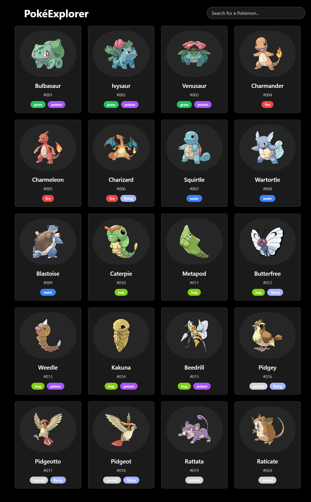

# PokéExplorer

A sleek, interactive Pokémon exploration web application built with React that allows users to browse and search for Pokémon with a beautiful, responsive UI.



## Features

- **Beautiful UI** with a responsive design that works on all devices
- **Animated Interface** powered by Framer Motion for smooth, engaging interactions
- **Pokémon Search** functionality to easily find your favorite Pokémon
- **Detailed Pokémon Information** including stats, abilities, type, height, and weight
- **Type-based Color Coding** for easy visual identification of Pokémon types
- **Modern Glass-morphism Design** with gradient backgrounds and backdrop blur effects

## Technology Stack

- **React** - Frontend library
- **Framer Motion** - Animation library
- **Tailwind CSS** - Utility-first CSS framework
- **PokéAPI** - Pokémon data source

## Installation

1. Clone the repository:
   ```bash
   git clone https://github.com/yourusername/pokeexplorer.git
   cd pokeexplorer
   ```

2. Install dependencies:
   ```bash
   npm install
   ```

3. Start the development server:
   ```bash
   npm start
   ```

4. Open your browser and navigate to `http://localhost:3000`

## Usage

- **Browse Pokémon**: Scroll through the grid of Pokémon cards
- **Search**: Use the search bar at the top to filter Pokémon by name
- **View Details**: Click on any Pokémon card to open a detailed modal with additional information
- **Close Details**: Click the X button or anywhere outside the modal to close it

## API Integration

PokéExplorer uses the [PokéAPI](https://pokeapi.co/) to fetch Pokémon data. The application initially loads 20 Pokémon and displays their:

- Name
- ID number
- Type(s)
- Official artwork
- Stats (in the detailed view)
- Physical characteristics (in the detailed view)
- Abilities (in the detailed view)

## Customization

### Adding More Pokémon

To increase the number of Pokémon loaded, modify the limit parameter in the API call:

```javascript
const response = await fetch("https://pokeapi.co/api/v2/pokemon?limit=50");
```

### Changing the Theme

The app uses a blue/indigo gradient theme. To change this, modify the background classes in the main container:

```jsx
<div className="min-h-screen bg-gradient-to-b from-[your-color] to-[your-color] text-white">
```

## Contributing

1. Fork the repository
2. Create your feature branch (`git checkout -b feature/amazing-feature`)
3. Commit your changes (`git commit -m 'Add some amazing feature'`)
4. Push to the branch (`git push origin feature/amazing-feature`)
5. Open a Pull Request

## License

This project is licensed under the MIT License - see the LICENSE file for details.

## Acknowledgments

- [PokéAPI](https://pokeapi.co/) for providing the Pokémon data
- [Framer Motion](https://www.framer.com/motion/) for the animation library
- [Tailwind CSS](https://tailwindcss.com/) for the utility-first CSS framework

## Future Enhancements

- Pagination or infinite scroll to load more Pokémon
- Evolution chain visualization
- Pokémon comparison feature
- Favorites system with local storage
- Advanced filtering (by type, stats, etc.)
- Dark/Light theme toggle
